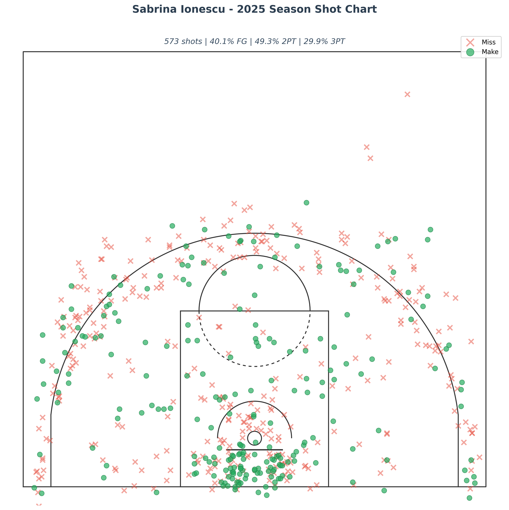
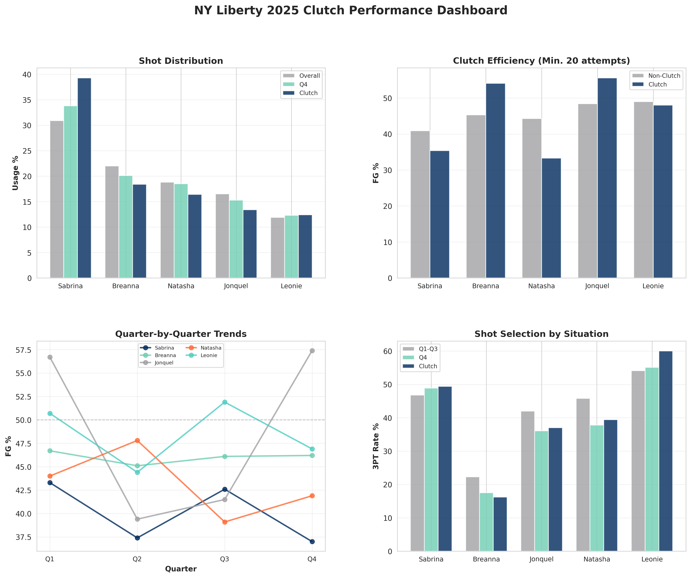

# WNBA Shot Analysis Portfolio

**End-to-end basketball analytics project using real WNBA API data**

Built by: Jess Reinhardt
Contact: www.linkedin.com/in/jessica-reinhardt | jess.reinhardt44@gmail.com

---

## 👀 Quick Start (For Non-Technical Viewers)

**Just want to see the analysis?** Click these links:

📊 **[View Key Findings](INSIGHTS.md)** - Executive summary with actionable recommendations

📄 **Download Player Reports:**
- [Sabrina Ionescu 2025 Report](outputs/player_reports/Ionescu_2025_Season_Report.docx) ← Click "Download" button
- [Breanna Stewart 2025 Report](outputs/player_reports/Stewart_2025_Season_Report.docx)
- [Jonquel Jones 2025 Report](outputs/player_reports/Jones_2025_Season_Report.docx)

📈 **View Visualizations:**
- [Shot Charts](outputs/shot_charts/real/) - Click any player to see their shot chart
- [Clutch Performance Dashboard](outputs/clutch_analysis/comprehensive_dashboard.png)
- [All Analysis Charts](outputs/clutch_analysis/)

*No coding required - just click and view!*

---

## 🏀 Project Overview

This project demonstrates professional basketball analytics skills through comprehensive shot analysis of NY Liberty players' 2025 season performance. Using real data from the official WNBA Stats API, I built a complete analytics pipeline that mirrors workflows used by professional basketball operations teams.

**Key Features:**
- Real shot-level data collection from stats.wnba.com API
- Clutch performance analysis (last 5 minutes of 4th quarter)
- Quarter-by-quarter efficiency trends
- Automated professional player report generation
- League average benchmarking

---

## 📊 What's Inside This Project

Below are examples of the analysis outputs. All files are in the folders listed above.

### Shot Charts
Clean, professional visualizations with accurate WNBA court dimensions:



### Clutch Performance Dashboard
Multi-panel analysis showing usage patterns, efficiency, and situational performance:



### Professional Player Reports
Automated Word document generation with statistics, visualizations, and development recommendations:
- [Sabrina Ionescu 2025 Season Report](outputs/player_reports/Ionescu_2025_Season_Report.docx)
- [Breanna Stewart 2025 Season Report](outputs/player_reports/Stewart_2025_Season_Report.docx)
- [Jonquel Jones 2025 Season Report](outputs/player_reports/Jones_2025_Season_Report.docx)

---

## 🔍 Key Insights

**Clutch Performance Analysis:**
- **Breanna Stewart** shoots **+8.8%** better in clutch situations (54.1% vs 45.3% rest of game)
- **Sabrina Ionescu** handles 39.3% of clutch possessions but efficiency drops -5.5%
- **Jonquel Jones** shoots 55.6% in clutch moments despite only 13.4% usage rate

*Clutch = last 5 minutes of Q4. Note: Score differential data not available in shot chart API; standard definition (within 5 points) would require play-by-play integration.*

**Actionable Recommendations:**
- Consider increasing Stewart's clutch usage given her +8.8% efficiency boost
- Explore shot selection optimizations for Ionescu's high-volume clutch attempts
- Leverage Jones' elite efficiency (49.0% FG overall, 42.4% from 3) more strategically

---

## 🛠️ Technical Stack

**Data Collection:**
- Browser developer tools (F12 → Network → XHR) to capture stats.wnba.com API requests
- JSON to CSV data pipeline
- Python data processing (pandas, numpy)

**Analysis:**
- Statistical analysis: shooting efficiency by situation, usage patterns, quarter trends
- Clutch performance definition: Last 5 minutes of Q4
- Benchmarking vs 2025 WNBA league averages (43.9% FG, 49.8% 2PT, 33.8% 3PT)
- Usage rate calculated as % of team shots taken while on court (differs from traditional USG% which includes turnovers and FTs)

**Visualization:**
- matplotlib & seaborn for shot charts and analytics dashboards
- Precise WNBA court dimensions (22.15 ft three-point arc)
- Color-coded efficiency visualizations

**Automation:**
- docx-js for automated Word report generation
- Professional formatting with NY Liberty branding
- Embedded shot chart visualizations

---

## 📁 Project Structure

```
wnba-shot-analysis/
├── data/
│   ├── raw/                    # Real shot data from WNBA API
│   │   ├── ionescu_shots_2025.csv
│   │   ├── stewart_shots_2025.csv
│   │   └── jones_shots_2025.csv
│   └── processed/              # Analysis outputs
├── src/
│   ├── convert_real_data.py    # JSON → CSV conversion
│   ├── clutch_analysis.py      # Clutch performance calculations
│   ├── clutch_visualizations.py # Charts and dashboards
│   ├── create_clean_shot_charts.py # Shot chart generation
│   └── generate_player_report.js # Automated report creation
├── outputs/
│   ├── shot_charts/            # Player shot visualizations
│   ├── clutch_analysis/        # Performance dashboards
│   └── player_reports/         # Word documents
├── notebooks/
│   └── analysis.ipynb          # Exploratory analysis
└── README.md
```

---

## 🚀 For Data Analysts: How to Reproduce This Analysis

*Note: This section is for technical users who want to run the code themselves. If you just want to view the results, see the "Quick Start" section at the top.*

### Data Collection
1. Go to stats.wnba.com shot chart for desired player
2. Open browser DevTools (F12) → Network tab
3. Filter for XHR requests
4. Locate `shotchartdetail` API call
5. Copy JSON response and save as .json file
6. Use `convert_real_data.py` to convert JSON to CSV

### Running Analysis

**Requirements:**
```bash
pip install pandas numpy matplotlib seaborn
npm install -g docx
```

**Generate Shot Charts:**
```bash
python src/create_clean_shot_charts.py
```

**Run Clutch Analysis:**
```bash
python src/clutch_analysis.py
python src/clutch_visualizations.py
```

**Create Player Reports:**
```bash
node src/generate_player_report.js "Player Name" data/raw/player_shots.csv outputs/shot_charts/player_chart.png outputs/reports/player_report.docx
```

---

## 📈 Skills Demonstrated

✅ **Data Engineering:** API data extraction, JSON parsing, data pipeline development  
✅ **Statistical Analysis:** Performance metrics, situational analysis, benchmarking  
✅ **Data Visualization:** Shot charts, multi-panel dashboards, professional formatting  
✅ **Automation:** Programmatic report generation, reproducible workflows  
✅ **Domain Knowledge:** Basketball analytics, WNBA rules, court dimensions  
✅ **Communication:** Executive summaries, actionable recommendations, visual storytelling

---

## 📊 Data Sources

- **Shot Data:** stats.wnba.com official API
- **League Averages:** Basketball-Reference.com 2025 WNBA season
- **Court Dimensions:** Official WNBA specifications (22.15 ft three-point line)

All data represents the 2025 WNBA regular season.

---

## 🎯 Future Enhancements

### Immediate Next Steps:
- [ ] **Integrate play-by-play data for true clutch filtering** (score within 5 points)
- [ ] **Add eFG% and TS% calculations** (requires free throw data from play-by-play API)
- [ ] **Clarify usage rate methodology** (currently % of team shots; traditional USG% includes TOs and FTs)

### Scalability - This Framework Can Expand:

**Different Metrics:**
- Effective Field Goal % (eFG%) and True Shooting % (TS%)
- Assisted vs unassisted shot rates (creation vs catch-and-shoot)
- Shot zones (rim, paint, midrange, three-point breakdown)
- Shot clock timing (early vs late clock efficiency)

**Different Benchmarks:**
- Compare to playoff teams specifically
- Opponent-adjusted efficiency (vs top defenses)
- Lineup-specific analysis (performance with different teammates)

**Different Scopes:**
- Full league analysis (12 teams, ~150 players)
- Opponent scouting reports (defensive tendencies, shot prevention)
- Historical trends (year-over-year player development)
- Playoff-specific clutch analysis

**Integration with Other Data:**
- Film breakdown (marry shot data with video)
- Tracking data (defender distance, player movement)
- Synergy data (play type: PnR, isolation, spot-up, transition)

---

## 🎬 Next Steps: Adding Film Context

Current analysis shows *what* is happening statistically. Film integration would reveal *why*:
- Are Sabrina's contested 3PTs the result of defensive coverages (two to the ball)?
- Is the roller open when she's pulling from three?
- Are Stewart's improved clutch numbers due to better shot selection or defensive attention elsewhere?

This statistical foundation provides the roadmap for targeted film study.

---

## 📫 Contact

Interested in discussing this project or basketball analytics opportunities?

- **LinkedIn:** www.linkedin.com/in/jessica-reinhardt
- **Email:** jess.reinhardt44@gmail.com
- **GitHub:** https://github.com/jrein44

---

## 📝 License

This project is for portfolio demonstration purposes. Data sourced from publicly available WNBA statistics.

---

*Last Updated: December 2025*

## 🔄 Player Comparisons

Example comparison analysis demonstrating ability to evaluate players side-by-side:

**Stewart vs. Ionescu - Clutch Performance:**
- Stewart: 54.1% clutch FG% (+8.8% vs rest of game)
- Ionescu: 35.4% clutch FG% (-5.5% vs rest of game)
- **Recommendation**: Increase Stewart's clutch usage

**Jones vs. League - 3PT Efficiency:**
- Jones: 42.4% from 3PT
- League Avg: 33.8% from 3PT
- **+8.6 percentage points** above average
- Elite floor spacer

